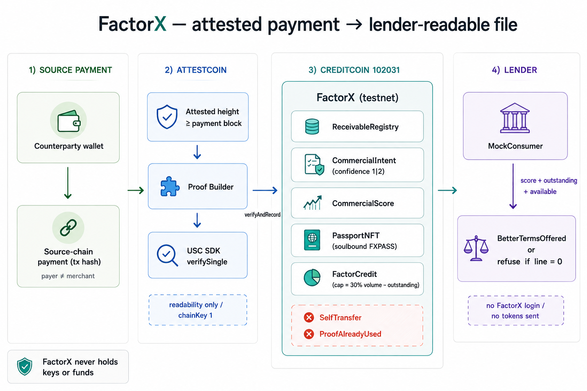

# FactorX

**FactorX turns an attested source-chain payment into a soulbound commercial file on Creditcoin that a lender contract can read.**

A studio or exporter already gets paid on-chain. Banks still see a blank record. I built the file in between: Attestcoin proves the settlement, Creditcoin stores the receivable / score / passport, and a separate consumer emits terms — including a refusal when the line is already drawn.

Live on Creditcoin testnet `102031`. App: [factorx.vercel.app](https://factorx.vercel.app) · Video: [youtu.be/y9v2vgB_cDg](https://youtu.be/y9v2vgB_cDg) · Docs: [factorx.vercel.app/docs](https://factorx.vercel.app/docs)

**[Judge it in 60 seconds](#judge-it-in-60-seconds)** · **[The core flow](#the-core-flow)** · **[Honesty](#honesty-what-is-real)** · **[Run locally](#run-it-locally)**

## Table of contents

- [The problem I set out to solve](#the-problem-i-set-out-to-solve)
- [What I built](#what-i-built)
- [Judge it in 60 seconds](#judge-it-in-60-seconds)
- [The core flow](#the-core-flow)
- [Architecture](#architecture)
- [Who holds the money / data](#who-holds-the-money--data)
- [Engineering decisions](#engineering-decisions)
- [Honesty: what is real](#honesty-what-is-real)
- [Tech stack](#tech-stack)
- [Project layout](#project-layout)
- [Run it locally](#run-it-locally)
- [License](#license)

## The problem I set out to solve

On-chain invoices exist. The credit file does not.

George’s studio is paid from a foreign client wallet. The receipt is public. A bank still asks for six months of statements he does not have. A DeFi score watches his bags, not his counterparties.

I refused to build “another on-chain FICO that increments when any wallet sends you dust.”

## What I built

1. **Submit** a source-chain payment hash (optional invoice id).
2. **Wait** until Attestcoin attested height covers that block, then prove inclusion (`verifySingle`).
3. **Record** the receivable on Creditcoin (`verifyAndRecord`). First success mints a soulbound FXPASS.
4. **Book** a line: 30% of attested volume minus outstanding. No tokens move.
5. **Read** as a lender: MockConsumer pulls score, outstanding, available and emits `BetterTermsOffered` — or refuses if the line is full.

User is the merchant wallet. Auth is MetaMask on Creditcoin testnet `102031`. The lender is a separate contract, not a FactorX login.

## Judge it in 60 seconds

1. Open [factorx.vercel.app](https://factorx.vercel.app). MetaMask → Creditcoin Testnet `102031`.
2. Dashboard → Connect → Submit Proof. Paste a source payment from a **different** wallet (self-pay reverts).
3. Watch the stepper: source receipt → attested height → inclusion proof → sign `verifyAndRecord`.
4. Open [Explorer](https://factorx.vercel.app/explorer). Follow source hash → Attestcoin → Creditcoin.
5. Confirm FXPASS on the dashboard / Blockscout.
6. Request Advance once. A second click at 0 available should fail.
7. Check terms. On Blockscout, read `BetterTermsOffered` on [MockConsumer](https://creditcoin-testnet.blockscout.com/address/0x2A845d32837CB3549f3e14cE160586961c522AEc).

Video of that path: [youtu.be/y9v2vgB_cDg](https://youtu.be/y9v2vgB_cDg).

This demo’s origin chain is Attestcoin `chainKey = 1` (Ethereum Sepolia). You only need that name when creating a test payment.

## The core flow

```text
counterparty pays merchant on source chain
        │
        ▼
Attestcoin attests the block (lags tip)
        │
        ▼
Proof Builder + USC SDK verifySingle
        │
        ▼
verifyAndRecord on Creditcoin 102031
        ├── ReceivableRegistry
        ├── CommercialIntent     confidence 1 | 2
        ├── CommercialScore      view
        ├── PassportNFT          soulbound, once
        └── FactorCredit         cap = 30% volume − debt
                │
                ▼
        MockConsumer.checkAndOfferTerms
```

Rules:

- `payer == beneficiary` → `SelfTransfer`
- same source hash twice → `ProofAlreadyUsed`
- score starts at 300, cap 950; credit needs ≥ 400
- available = `volume * 30% − outstanding`
- MockConsumer is not FactorX. If available is 0 it posts a refusal.

## Architecture



```text
Browser (Next.js) ── GET /api/attestcoin/proof ── Proof Builder + origin RPC
        │
        ├── MetaMask / Creditcoin RPC 102031
        └── USC SDK verifySingle
                    │
                    ▼
         Creditcoin contracts (testnet)
```

Hosted: Vercel app + the proof API route.  
On-chain: seven contracts on Creditcoin testnet.  
Local: Foundry tests, `npm run dev`.

| Contract | Address |
|----------|---------|
| ReceivableRegistry | [`0x1e578b5a…8b7F7`](https://creditcoin-testnet.blockscout.com/address/0x1e578b5aE11BEE48361b70470E8FfD939148b7F7) |
| AttestcoinVerifier | [`0x75304e98…C3101`](https://creditcoin-testnet.blockscout.com/address/0x75304e98D8E37A91E3DC2d7c5bf1b363FebC3101) |
| CommercialScore | [`0xe90195df…EEbdE02`](https://creditcoin-testnet.blockscout.com/address/0xe90195df4183865CF1533F5B90f15AC37EEbdE02) |
| FactorCredit | [`0x96e99678…3afEAf`](https://creditcoin-testnet.blockscout.com/address/0x96e99678067c62c441152E69975438768e3afEAf) |
| PassportNFT | [`0x1E3E565b…D3f5`](https://creditcoin-testnet.blockscout.com/address/0x1E3E565b13013D430446185BaEcfc8d97fD0D3f5) |
| CommercialIntent | [`0xB37b771B…75796aa`](https://creditcoin-testnet.blockscout.com/address/0xB37b771B1337cF555dFAeF8bd7190445D75796aa) |
| MockConsumer | [`0x2A845d32…22AEc`](https://creditcoin-testnet.blockscout.com/address/0x2A845d32837CB3549f3e14cE160586961c522AEc) |

## Who holds the money / data

FactorX never holds keys or funds. `requestAdvance` writes a number. It does not transfer ETH, tCTC, or a stablecoin.

Receivables, score, passport, and outstanding live on Creditcoin and are readable by anyone who can call the contracts. Invoice id is a `bytes32` hash of a string the merchant typed — not a verified accounting invoice.

## Engineering decisions

**Readability only.** Writability is out of season scope. I did not fake a source-chain message.

**SDK then record, not a fake precompile success.** Same-tx Solidity `verifyAndEmit` on `0x0FD2` did not match this testnet’s public selector. I kept `@gluwa/usc-sdk` `verifySingle` and bound the Creditcoin row to the source hash with replay protection.

**Self-pay and replay are protocol errors.** A screenshot farm should fail on-chain, not in CSS.

**Lender is a second contract.** MockConsumer has no admin key into FactorX. That is the composability demo.

**Line, not vault.** Shipping a toy token transfer would look like cash and lie about it.

**Invoice confidence is a flag.** `1` = payment only, `2` = invoice string present. Not amount-matched factoring.

## Honesty: what is real

| Piece | Status |
|-------|--------|
| Live app + dashboard + explorer + docs | Real — [factorx.vercel.app](https://factorx.vercel.app) |
| Contracts on Creditcoin testnet 102031 | Real — addresses above |
| Attestcoin height wait + Proof Builder + `verifySingle` | Real on this testnet |
| `verifyAndRecord`, score, soulbound mint, replay / self-pay | Real |
| MockConsumer `BetterTermsOffered` | Real |
| Same-transaction BlockProver `verifyAndEmit` in Solidity | Not shipped — selector mismatch |
| Token / stablecoin disbursement | Not shipped |
| USD amounts | Not shipped — values are 18-decimal source units |
| Invoice-amount matching / KYC | Not shipped |
| Attestcoin writability | Out of scope |
| Mainnet | Not shipped |
| Multi-member team | Solo |

## Tech stack

- Solidity 0.8.24, Foundry, EVM london, `via_ir` for the verifier
- Next.js 14, viem, Tailwind
- `@gluwa/usc-sdk@0.18.0`
- Creditcoin testnet RPC + Blockscout + ASC dashboard

## Project layout

```text
src/                 contracts
test/                FactorX.t.sol, PassportNFT.t.sol
script/              Anvil deploy
frontend/app/        landing, dashboard, explorer, docs, proof API
frontend/lib/        chain.ts, contracts.ts
docs/                Attestcoin notes
```

Open first: `README.md`, `frontend/app/docs/page.tsx`, `src/AttestcoinVerifier.sol`, `src/MockConsumer.sol`.

## Run it locally

```bash
cd frontend
npm install
npm run dev
```

http://localhost:3000 — MetaMask on `102031`, RPC `https://rpc.cc3-testnet.creditcoin.network`.

```bash
forge test -vv
```

Creditcoin broadcasts need `--legacy` and `FOUNDRY_EVM_VERSION=london`. RPC may log a missing `mixHash`; the tx can still land.

Lender reads without the UI:

```bash
RPC=https://rpc.cc3-testnet.creditcoin.network
ME=0xYourMerchantWallet   # 40 hex, not a tx hash

cast call 0xe90195df4183865CF1533F5B90f15AC37EEbdE02 "getCommercialScore(address)(uint256)" $ME --rpc-url $RPC
cast call 0x96e99678067c62c441152E69975438768e3afEAf "outstanding(address)(uint256)" $ME --rpc-url $RPC
cast call 0x2A845d32837CB3549f3e14cE160586961c522AEc "checkAndOfferTerms(address)(string)" $ME --rpc-url $RPC
```

## License

MIT.
